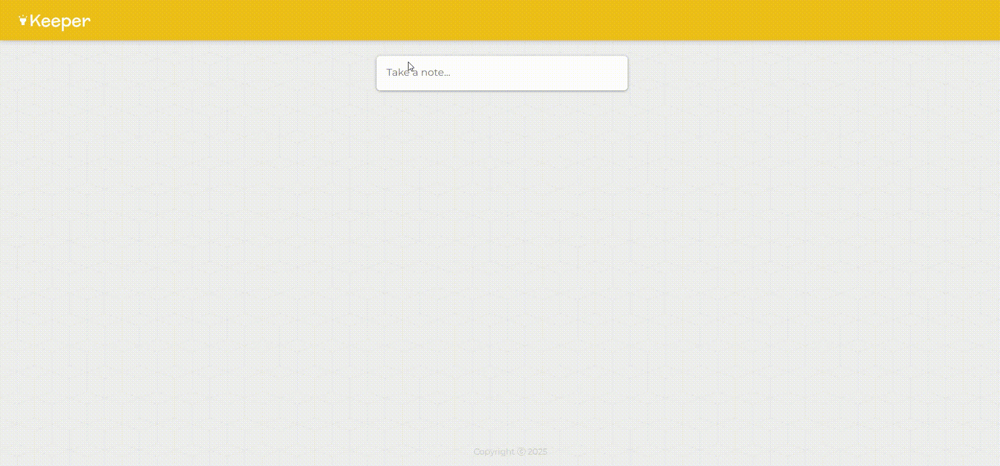

# Keeper App

A simple note-taking web application built with React and Vite, inspired by Google Keep. Users can add, view, and delete notes with a clean Material UI design.

## Features

- Add notes with a title and content
- Delete notes
- Responsive and modern UI using Material UI
- Styled with custom CSS



## Project Structure

```
.
├── index.html
├── package.json
├── vite.config.js
├── public/
│   └── styles.css
└── src/
    ├── index.jsx
    └── components/
        ├── App.jsx
        ├── CreateArea.jsx
        ├── Footer.jsx
        ├── Header.jsx
        └── Note.jsx
```

## Getting Started

### Prerequisites

- [Node.js](https://nodejs.org/) (v14 or higher recommended)
- [npm](https://www.npmjs.com/)

### Installation

1. Clone the repository:
   ```sh
   git clone https://github.com/natural-mess/Keeper-App.git
   cd Keeper-App
   ```

2. Install dependencies:
   ```sh
   npm install
   ```

### Running the App

Start the development server:
```sh
npm run dev
```
Open [http://localhost:5173](http://localhost:5173) in your browser to view the app.

### Building for Production

To build the app for production:
```sh
npm run build
```

## Dependencies

- [React](https://reactjs.org/)
- [Vite](https://vitejs.dev/)
- [Material UI](https://mui.com/)
- [@mui/icons-material](https://mui.com/material-ui/material-icons/)
